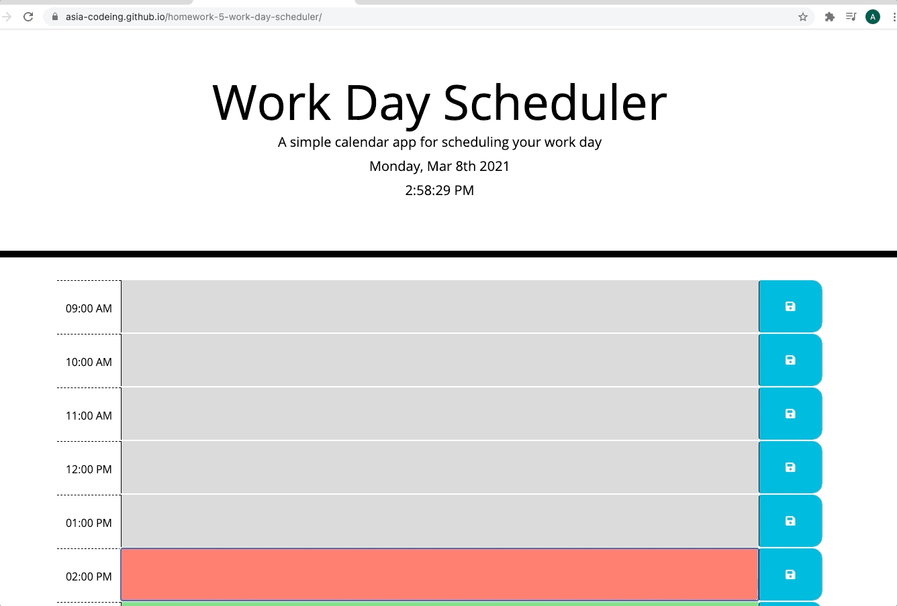

# homework-5-work-day-scheduler
Work Day Scheduler

* Using moment.js to get the curent date and time, whene I open the planner the current day and time are displayed at the top of the calendar.
* Creating timeblocks for standard business hours.
* Creating conditional statments for each timeblock to get the color coded to indicate whether it is in the past, present, or future.
* In the timblock I can enter an event and when I click the save button for that timeblock the text for that event is saved in local storage.
* Even if I refresh the page the saved events persist.

# Screenshot to deployed application:

# Link to deployed application:
https://asia-codeing.github.io/homework-5-work-day-scheduler/